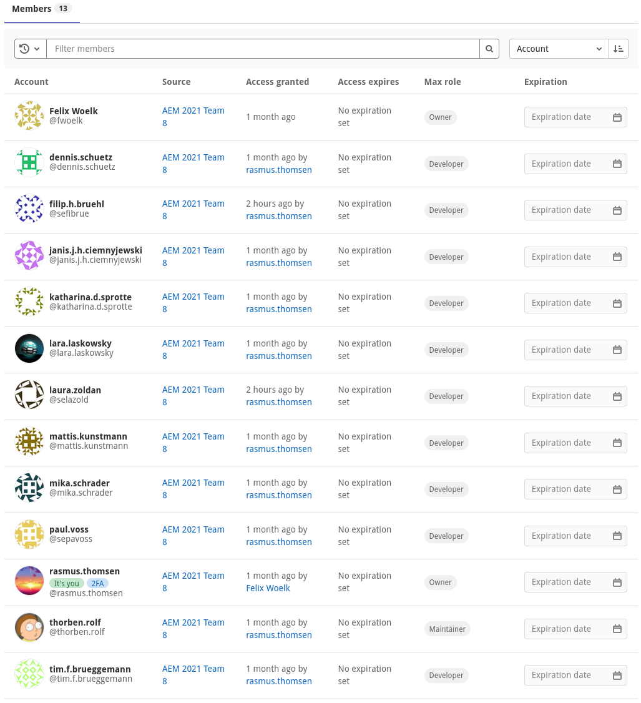
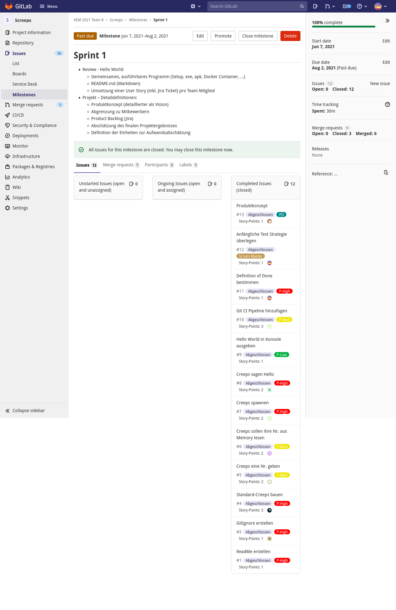

# Hello World Sprint

## Product Owner

### Erstelle ein Produktkonzept und erkläre das Konzept den anderen Teammitgliedern

Unsere Screeps-Kolonie sollte eine automatisierte Job-Verteilung an die Creeps haben.
Diese Jobs sind zum Beispiel:

- [ ] Energie Abbauen/Aufsammeln
- [ ] Energie Transportieren
- [ ] Strukturen bauen und reparieren
- [ ] Den Room-Controller upgraden
- [ ] Kolonie verteidigen

Zusätzlich zu den Creeps, können ebenfalls Türme genutzt werden um Gegner zu attackieren, Creeps zu heilen und Strukturen zu reparieren. Die Kolonie sollte so selbst erhaltend sein, das automatisch neue Screeps gespawned werden, wenn sie benötigt sind. Der Spieler sollte daher nur noch bestimmen müssen, wo Strukturen gesetzt werden und die Creeps erledigen den Rest. Das Skript sollte von selbst laufen und nicht abstürzen.

#### Wie stellst du sicher, dass das Produkt-Konzept von allen Team Mitgliedern richtig verstanden worden ist?

Es wurden alle Teammitglieder durch das Sprint Review aufgeklärt und hatten Gelegenheit, es zu hinterfragen.

### Erstelle und fülle das Product Backlog in Jira

Issues wurden Gitlab erstellt, damit wir Source-Control und Issues auf der selben Platform haben. Diese wurden vom PO erstellt und zusammen mit dem SM priorisiert. Das Entwicklerteam konnte dann die einzelnen Tickets bei der Sprintplanung priorisieren und in den Sprint hineinziehen.

#### Nutze dabei die in der Vorlesung vorgestellte Struktur von Stories

Da wir unsere Tickets in GitLab anlegen, haben wir nicht die Möglichkeit Task anzulegen. Stattdessen versuchen wir die Issues so zu formulieren und mit dem Entwicklerteam abzustimmen, dass sie in etwa die Größe und den Aufwand eines Tasks haben.

#### Beginne mit den wichtigsten Inhalten

Während des Kick-Off Events des ersten Sprints haben wir im Team uns überlegt was wir als ersten Umsetzten müssen, um darauf effizient in den folgenden Sprints aufzubauen.

##### Nutze bei Bedarf Epics, Stories, Tasks und Subtasks, um das Backlog zu strukturieren

Wir nutzen in Gitlab Issues und Milestones, um die Issues den einzelnen Sprints zuzuweisen. Außerdem haben wir Labels, mit dem das Backlog strukturiert wird.

#### Bewerte den Business Value für jeden Eintrag im Product Backlog

Das haben wir anhand der Prioritäten dargestellt. Vorgänge, ein sehr hohes Business Value hatten, haben wir vorgezogen.

### Überlege wie du während des Projekts Feedback von Kunden einsammeln kannst

Nach der Präsentation des Increments im Sprint Review können die Stakeholder uns Feedback geben.

### Überlege wie du während des Projekts einen Vergleich mit Mitbewerbern vornehmen kannst

Wir können uns mit anderen Kolonien, die auch zu einem ähnlichen Zeitpunkt wie wir angefangen haben, vergleichen. So können wir z.B. vergleichen wie viel Energie wir abbauen, wie effizient wir diese nutzen und welches Room-Controller-Level Mitbewerber haben.

## Scrum Master

### Sorge dafür, dass je ein Projekt in Jira/GitLab (Tickets) und auf GitLab (VCS) erstellt wird und stelle die Zugriffsrechte für das Team und den Product Owner sicher

Wir nutzen lediglich Gitlab. Die Zugriffsrechte wurden sichergestellt. Die Entwickler sind als "Developer" eintragen. Im Unterschied zum PO, der als "Maintainer" eingetragen ist, dürfen die Entwickler nicht auf den master mergen.

### Bereite eine sinnvolle Möglichkeit zur Nutzung einer Burndown Chart vor

Wir nutzen für die Burndownchart unsere Tafel. Das ist einfacher zu machen als mit einem Online-Tool und die Tafel ist gut und stets für alle sichtbar in unserem Raum.

### Bereite die Bestimmung der Teamgeschwindigkeit vor:

#### Definiere mit dem Team die Einheiten (z.B. Story Points)

Wir nutzen wie vorgeschlagen Story Points.

#### Definiere mit dem Team die Kalibrierung (Wie viel ist ein Story Point?)

Für unsere Story Points nutzen wir die Formel ${Stunden Aufwand} \cdot {Schwierigkeit}$. Dabei ist Schwierigkeit eine Zahl von 1-3, wobei 1 leicht, 2 medium und 3 schwer ist. Somit wird nicht nur die Zeit sondern auch die Schwierigkeit einer Aufgabe beachtet.

### Bereite die Aufwandsabschätzung vor indem du…

#### … die „Definition of Done“ mit dem Team festlegst

Wir haben im Team uns auf die folgende Definition of Done geeinigt:

##### Unsere Definition of Done

Code ist nur Done, wenn er:

- Formatiert ist
- Der Linter keine Anmerkungen hat
- Die MR-Pipeline erfolgreich ist
- Der Code Reviewer keine Anmerkungen hat
- Der PO den Code abnimmt

#### … dich mit dem Team eine anfängliche Teststrategie überlegst

Für den Anfang testen wir auf unseren eigenen Screeps-Kolonien, machen also manuelles testen. Wir wollen im Laufe des zweiten Sprints Unit- und vor allem Integrationtests hinzufügen, damit wir automatisch Aspekte des Spiels testen können und somit Regressionen vermeiden.

### Unterstütze das Team und den PO beim Erlernen der Tools:

#### Wie kann das Team voneinander lernen?

Wir können bei Besprechungen wie dem Keep-Drop-Try voneinander lernen. Das haben wir bereits bei der ersten Iteration davon gemerkt, da beim "Try" viele Hilfreiche Vorschläge kamen (siehe dafür [unserer Gitlab-Repo](https://gitlab.iue.fh-kiel.de/aem-2021-team-8/screeps/-/tree/master/Doku/Keep%20Drop%20Try))

#### Wie kann Wissen von den stärkeren Team Mitgliedern zu den schwächeren transportiert werden?

Wir haben eine Sitzordnung angenommen, bei der das Team nah zusammen sitzt (soweit Corona es erlaubt), damit es nicht innerhalb des Teams zu Gruppenbildung kommt und somit sich Wissen auf einige Teilgruppen konzentriert. Außerdem ist somit der Austausch untereinander einfacher.

### Bereite die Planung des ersten Sprints vor:

#### Sichte das Product Backlog und kläre mit dem PO unvollständige und unklare Einträge

Wir haben zusammen die Einträge besprochen. Daraus hat sich folgende Liste für den ersten Sprint ergeben:

Mit dieser Liste wollen wir das Sprintziel für Sprint 1 erreichen.

#### Erinnere den PO daran, Prioritäten unter Berücksichtigung von Aufwand und Business Value zu vergeben

Wie auf dem vorherigen Screenshot zu sehen ist, haben wir zusammen verschiedene Prioritäten unter Berücksichtigung dieser Kriterien gegeben. Dabei steht das Label "P-Low" (grün) dafür, dass das Issue eine niedrige Priorität hat, "P-Med" (gelb) dafür, dass es eine mittlere Priorität hat und "P-High" (rot) dafür, dass es einige hohe Priorität hat. Außerdem haben wir noch die Priorität "Blocker",
